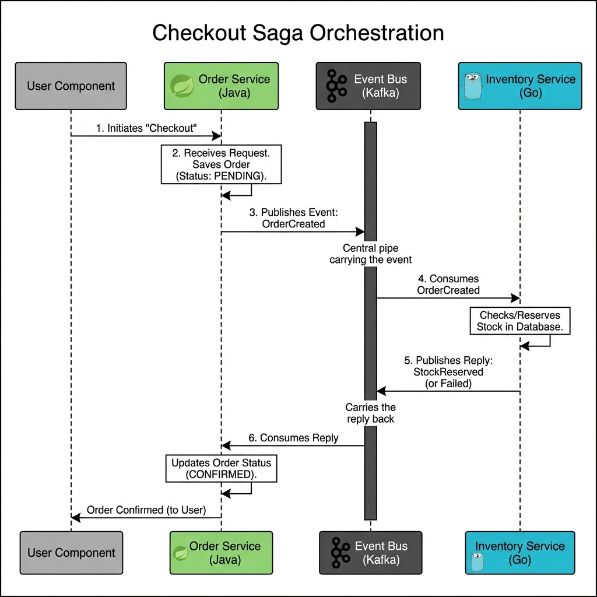
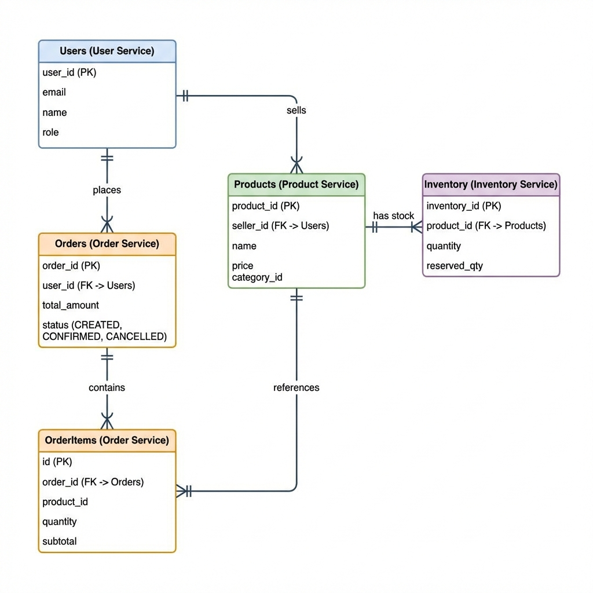

# TokoBapak Architecture Documentation

## System Overview

TokoBapak is a multi-vendor e-commerce marketplace designed with a microservices architecture to ensure scalability, maintainability, and independent deployment of services.

---

## High-Level Architecture

## High-Level Architecture


```
                                    ┌─────────────────────┐
                                    │   Load Balancer     │
                                    │    (Nginx/ALB)      │
                                    └──────────┬──────────┘
```

---

## Microservices Architecture

### Design Principles

1. **Single Responsibility**: Each service handles one business domain
2. **Loose Coupling**: Services communicate via APIs, no direct DB access
3. **Independent Deployment**: Each service can be deployed independently
4. **Technology Agnostic**: Use the best technology for each service
5. **Resilience**: Services handle failures gracefully

### Service Communication



```
┌─────────────┐      HTTP/REST       ┌─────────────┐
│   Service A │ ◄──────────────────► │   Service B │
└─────────────┘                      └─────────────┘

┌─────────────┐      Event Bus       ┌─────────────┐
│   Service A │ ────────────────────► │   Service B │
└─────────────┘      (Kafka)         └─────────────┘
```

**Synchronous**: REST/HTTP for real-time requests (e.g. Frontend -> API Gateway)
**Asynchronous**: Kafka for distributed transactions (Saga Pattern) like Checkout Flow.

---

## Service Architecture Patterns

### NestJS Services (Product, Cart)

```
src/
├── main.ts                    # Application bootstrap
├── app.module.ts              # Root module
├── config/                    # Configuration
```

### Go Service (Catalog, Inventory) - Clean Architecture

```
cmd/
└── server/
    └── main.go               # Application entry point

internal/
├── domain/                   # Business entities & interfaces
├── usecase/                  # Business logic
├── repository/               # Data access layer
└── delivery/                 # Transport layer
```

---

## Data Architecture

### Database Strategy

| Service | Database | Type | Purpose |
|---------|----------|------|---------|
| Product | PostgreSQL | RDBMS | Products, variants, media |
| Catalog | PostgreSQL | RDBMS | Categories, brands |
| Cart | Redis | Key-Value | Session-based cart data |
| User | PostgreSQL | RDBMS | User accounts |
| Order | PostgreSQL | RDBMS | Orders, transactions |
| Inventory | PostgreSQL | RDBMS | Stock management |
| Search | Elasticsearch | Search | Full-text search |

### Database Per Service Pattern

Each service owns its own database schema to ensure loose coupling.

---

## Entity Relationship Diagrams

### Core Services ERD



### Text-Based ERD Reference

#### Product Service

                                               │
                     ┌─────────────────────────┼─────────────────────────┐
                     │                         │                         │
           ┌─────────▼─────────┐    ┌─────────▼─────────┐    ┌─────────▼─────────┐
           │   Frontend Web    │    │   Frontend Admin  │    │  Frontend Mobile  │
           │    (Next.js)      │    │    (Next.js)      │    │  (React Native)   │
           │     :3000         │    │      :3100        │    │       App         │
           └─────────┬─────────┘    └─────────┬─────────┘    └─────────┬─────────┘
                     │                         │                         │
                     └─────────────────────────┼─────────────────────────┘
                                               │
                                    ┌──────────▼──────────┐
                                    │     API Gateway     │
                                    │       (Kong)        │
                                    │       :8000         │
                                    └──────────┬──────────┘
                                               │
        ┌──────────────────────────────────────┼──────────────────────────────────────┐
        │                  │                   │                   │                  │
┌───────▼───────┐  ┌───────▼───────┐  ┌───────▼───────┐  ┌───────▼───────┐  ┌───────▼───────┐
│   Product     │  │   Catalog     │  │    Cart       │  │    Order      │  │   Payment     │
│   Service     │  │   Service     │  │   Service     │  │   Service     │  │   Service     │
│  (NestJS)     │  │    (Go)       │  │  (NestJS)     │  │ (Spring Boot) │  │ (Spring Boot) │
│    :3001      │  │    :3002      │  │    :3003      │  │    :3004      │  │    :3005      │
└───────┬───────┘  └───────┬───────┘  └───────┬───────┘  └───────┬───────┘  └───────┬───────┘
        │                  │                   │                  │                  │
        └──────────────────┼───────────────────┼──────────────────┼──────────────────┘
                           │                   │                  │
              ┌────────────▼───────────────────▼──────────────────▼────────────┐
              │                          Databases                              │
              │  ┌─────────────┐  ┌─────────────┐  ┌─────────────┐             │
              │  │ PostgreSQL  │  │    Redis    │  │Elasticsearch│             │
              │  │   :5432     │  │    :6379    │  │   :9200     │             │
              │  └─────────────┘  └─────────────┘  └─────────────┘             │
              └────────────────────────────────────────────────────────────────┘
```

---

## Microservices Architecture

### Design Principles

1. **Single Responsibility**: Each service handles one business domain
2. **Loose Coupling**: Services communicate via APIs, no direct DB access
3. **Independent Deployment**: Each service can be deployed independently
4. **Technology Agnostic**: Use the best technology for each service
5. **Resilience**: Services handle failures gracefully

### Service Communication

```
┌─────────────┐      HTTP/REST       ┌─────────────┐
│   Service A │ ◄──────────────────► │   Service B │
└─────────────┘                      └─────────────┘

┌─────────────┐      Event Bus       ┌─────────────┐
│   Service A │ ────────────────────► │   Service B │
└─────────────┘      (Kafka)         └─────────────┘
```

**Synchronous**: REST/HTTP for real-time requests
**Asynchronous**: Kafka/RabbitMQ for event-driven communication (planned)

---

## Service Architecture Patterns

### NestJS Services (Product, Cart)

```
src/
├── main.ts                    # Application bootstrap
├── app.module.ts              # Root module
├── config/                    # Configuration
│   └── database.config.ts
├── common/                    # Shared code
│   ├── filters/              # Exception filters
│   ├── guards/               # Auth guards
│   ├── interceptors/         # Request/response interceptors
│   └── decorators/           # Custom decorators
└── modules/
    └── <feature>/
        ├── dto/              # Data Transfer Objects
        ├── entities/         # Database entities
        ├── <feature>.controller.ts
        ├── <feature>.service.ts
        └── <feature>.module.ts
```

### Go Service (Catalog) - Clean Architecture

```
cmd/
└── server/
    └── main.go               # Application entry point

internal/
├── domain/                   # Business entities & interfaces
│   ├── category.go
│   ├── brand.go
│   └── errors.go
├── usecase/                  # Business logic
│   ├── category_uc.go
│   └── brand_uc.go
├── repository/               # Data access layer
│   └── postgres/
│       ├── category_repo.go
│       └── brand_repo.go
└── delivery/                 # Transport layer
    └── http/
        ├── handler.go
        └── brand_handler.go
```

---

## Data Architecture

### Database Strategy

| Service | Database | Type | Purpose |
|---------|----------|------|---------|
| Product | PostgreSQL | RDBMS | Products, variants, media |
| Catalog | PostgreSQL | RDBMS | Categories, brands |
| Cart | Redis | Key-Value | Session-based cart data |
| User | PostgreSQL | RDBMS | User accounts |
| Order | PostgreSQL | RDBMS | Orders, transactions |
| Search | Elasticsearch | Search | Full-text search |

### Database Per Service Pattern

```
┌─────────────────┐     ┌─────────────────┐
│ Product Service │     │ Catalog Service │
└────────┬────────┘     └────────┬────────┘
         │                       │
         ▼                       ▼
┌─────────────────┐     ┌─────────────────┐
│ tokobapak_      │     │ tokobapak_      │
│ products        │     │ catalog         │
│ (PostgreSQL)    │     │ (PostgreSQL)    │
└─────────────────┘     └─────────────────┘
```

Benefits:
- Independent schema evolution
- Service isolation
- Optimized for service needs
- Independent scaling

---

## Entity Relationship Diagrams

### Product Service ERD

```
┌─────────────────────────────────────────────────────┐
│                      products                        │
├─────────────────────────────────────────────────────┤
│ id           : uuid (PK)                            │
│ seller_id    : uuid (FK → users)                    │
│ name         : varchar(255)                          │
│ slug         : varchar(255) UNIQUE                   │
│ description  : text                                  │
│ price        : decimal(15,2)                         │
│ discount_price: decimal(15,2)                        │
│ category_id  : uuid (FK → categories)               │
│ brand_id     : uuid (FK → brands)                   │
│ status       : enum                                  │
│ attributes   : jsonb                                 │
│ weight       : decimal(8,2)                          │
│ dimensions   : jsonb                                 │
│ view_count   : integer                               │
│ rating       : decimal(3,2)                          │
│ review_count : integer                               │
│ created_at   : timestamp                             │
│ updated_at   : timestamp                             │
└───────────────────────┬─────────────────────────────┘
                        │
         ┌──────────────┼──────────────┐
         │              │              │
         ▼              ▼              ▼
┌─────────────┐  ┌─────────────┐  ┌─────────────┐
│  variants   │  │    media    │  │   reviews   │
├─────────────┤  ├─────────────┤  ├─────────────┤
│ id          │  │ id          │  │ id          │
│ product_id  │  │ product_id  │  │ product_id  │
│ sku         │  │ url         │  │ user_id     │
│ name        │  │ type        │  │ rating      │
│ price       │  │ order       │  │ comment     │
│ stock       │  │ alt         │  │ created_at  │
│ attributes  │  │ created_at  │  └─────────────┘
│ is_active   │  └─────────────┘
│ created_at  │
│ updated_at  │
└─────────────┘
```

### Catalog Service ERD

```
┌─────────────────────────────────────┐
│             categories               │
├─────────────────────────────────────┤
│ id           : uuid (PK)            │
│ name         : varchar(255)          │
│ slug         : varchar(255) UNIQUE   │
│ description  : text                  │
│ parent_id    : uuid (FK → self)     │◄───┐
│ image_url    : text                  │    │ Self-referential
│ icon_url     : text                  │    │ for hierarchy
│ display_order: integer               │    │
│ is_active    : boolean               │────┘
│ created_at   : timestamp             │
│ updated_at   : timestamp             │
└─────────────────────────────────────┘

┌─────────────────────────────────────┐
│              brands                  │
├─────────────────────────────────────┤
│ id           : uuid (PK)            │
│ name         : varchar(255)          │
│ slug         : varchar(255) UNIQUE   │
│ logo_url     : text                  │
│ is_active    : boolean               │
│ created_at   : timestamp             │
│ updated_at   : timestamp             │
└─────────────────────────────────────┘
```

---

## Security Architecture

### Authentication Flow (Planned)

```
┌──────────┐      1. Login        ┌──────────────┐
│  Client  │ ────────────────────► │ Auth Service │
└──────────┘                      └──────┬───────┘
     │                                   │
     │                            2. Verify credentials
     │                                   │
     │                            ┌──────▼───────┐
     │                            │ User Service │
     │                            └──────┬───────┘
     │                                   │
     │      3. JWT Token                 │
     ◄───────────────────────────────────┘
     │
     │      4. API Request + JWT
     ▼
┌──────────────┐      5. Verify JWT    ┌──────────────┐
│  API Gateway │ ────────────────────► │ Auth Service │
└──────┬───────┘                      └──────────────┘
       │
       │      6. Forward to service
       ▼
┌──────────────┐
│   Service    │
└──────────────┘
```

### Security Measures

| Layer | Measure |
|-------|---------|
| Transport | HTTPS/TLS |
| Authentication | JWT tokens |
| Authorization | Role-based access (RBAC) |
| Input | Validation pipes |
| Database | Prepared statements |
| Secrets | Environment variables |
| CORS | Configured origins |

---

## Deployment Architecture

### Container Strategy

```
┌─────────────────────────────────────────────────────────────┐
│                    Kubernetes Cluster                        │
│                                                              │
│  ┌─────────────────────────────────────────────────────┐    │
│  │                    Namespace: tokobapak              │    │
│  │                                                      │    │
│  │  ┌─────────────┐  ┌─────────────┐  ┌─────────────┐  │    │
│  │  │  Deployment │  │  Deployment │  │  Deployment │  │    │
│  │  │  product-   │  │  catalog-   │  │  cart-      │  │    │
│  │  │  service    │  │  service    │  │  service    │  │    │
│  │  │  replicas:3 │  │  replicas:2 │  │  replicas:2 │  │    │
│  │  └─────────────┘  └─────────────┘  └─────────────┘  │    │
│  │                                                      │    │
│  │  ┌─────────────┐  ┌─────────────┐                   │    │
│  │  │  Service    │  │  Service    │                   │    │
│  │  │  ClusterIP  │  │  ClusterIP  │                   │    │
│  │  └─────────────┘  └─────────────┘                   │    │
│  │                                                      │    │
│  │  ┌─────────────────────────────────────────────┐    │    │
│  │  │              Ingress Controller              │    │    │
│  │  │           (nginx / Kong Gateway)            │    │    │
│  │  └─────────────────────────────────────────────┘    │    │
│  └─────────────────────────────────────────────────────┘    │
└─────────────────────────────────────────────────────────────┘
```

### Docker Images

| Service | Base Image | Size |
|---------|------------|------|
| Product | node:22-alpine | ~200MB |
| Catalog | golang:alpine | ~15MB |
| Cart | node:22-alpine | ~180MB |

---

## Monitoring & Observability

### Metrics Stack (Planned)

```
┌─────────────┐     ┌─────────────┐     ┌─────────────┐
│  Services   │────►│ Prometheus  │────►│   Grafana   │
│  (metrics)  │     │  (collect)  │     │ (visualize) │
└─────────────┘     └─────────────┘     └─────────────┘
```

### Logging Stack

```
┌─────────────┐     ┌─────────────┐     ┌─────────────┐
│  Services   │────►│ Fluentd/    │────►│Elasticsearch│
│   (logs)    │     │ Logstash    │     │   Kibana    │
└─────────────┘     └─────────────┘     └─────────────┘
```

### Key Metrics

- Request latency (p50, p95, p99)
- Error rate
- Request throughput
- Database connection pool
- Redis cache hit ratio
- CPU/Memory usage

---

## Scalability Considerations

### Horizontal Scaling

| Service | Scaling Trigger | Strategy |
|---------|-----------------|----------|
| Product | CPU > 70% | Add replicas |
| Catalog | CPU > 70% | Add replicas |
| Cart | Redis connections | Add replicas |
| API Gateway | Request rate | Add nodes |

### Caching Strategy

```
┌──────────┐      ┌──────────┐      ┌──────────┐
│  Client  │─────►│  Redis   │─────►│  Database│
└──────────┘      │  Cache   │      └──────────┘
                  └──────────┘
                       │
                  Cache Hit → Return
                  Cache Miss → Query DB → Cache → Return
```

---

## Future Enhancements

### Phase 2 Services
- Order Service (Java/Spring Boot)
- Payment Service (Java/Spring Boot)
- User/Auth Service (Java/Spring Boot)
- Notification Service (NestJS)

### Phase 3 Services
- Search Service (NestJS + Elasticsearch)
- Recommendation Service (Python/FastAPI)
- Analytics Service (Python/FastAPI)
- Chat Service (NestJS + Socket.io)

### Infrastructure Roadmap
- [ ] Kubernetes deployment (Helm charts)
- [ ] CI/CD pipelines (GitHub Actions)
- [ ] Monitoring (Prometheus + Grafana)
- [ ] Distributed tracing (Jaeger)
- [ ] Message queue (Kafka/RabbitMQ)

---

*Document Version: 1.0 | Last Updated: January 2026*
