# TokoBapak Sequence Diagrams

This document contains sequence diagrams for key business flows in the TokoBapak e-commerce platform.

## Table of Contents

1. [User Authentication](#1-user-authentication)
2. [Product Browsing](#2-product-browsing)
3. [Add to Cart](#3-add-to-cart)
4. [Checkout Flow](#4-checkout-flow)
5. [Payment Processing](#5-payment-processing)
6. [Order Fulfillment](#6-order-fulfillment)
7. [Seller Registration](#7-seller-registration)
8. [Product Review](#8-product-review)

---

## 1. User Authentication

### 1.1 User Registration

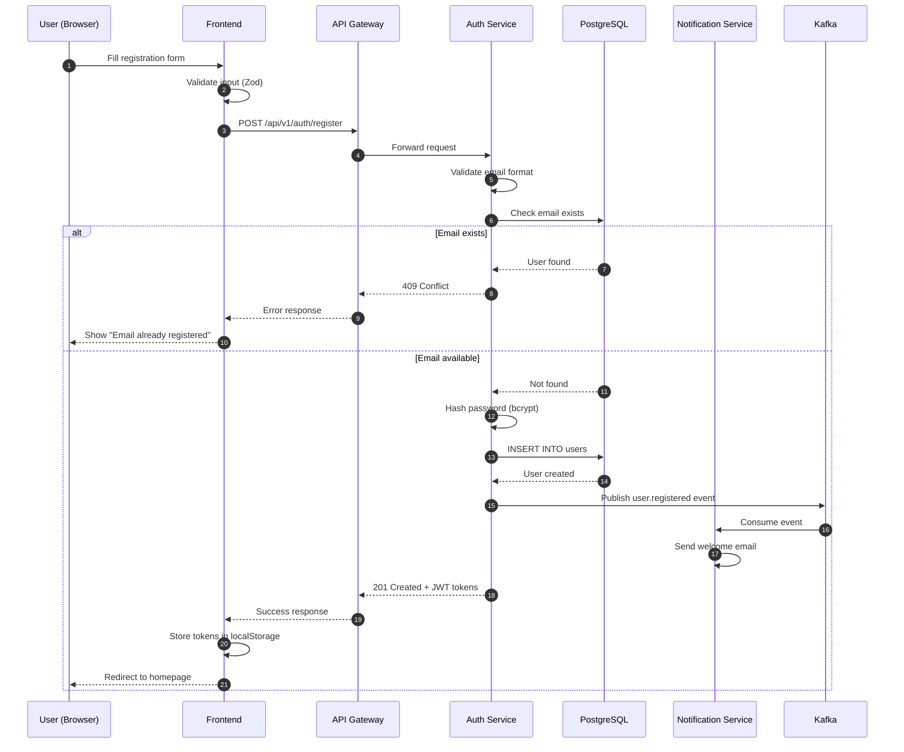
```mermaid
sequenceDiagram
    autonumber
    participant U as User (Browser)
    participant FE as Frontend
    participant GW as API Gateway
    participant AS as Auth Service
    participant DB as PostgreSQL
    participant NS as Notification Service
    participant K as Kafka

    U->>FE: Fill registration form
    FE->>FE: Validate input (Zod)
    FE->>GW: POST /api/v1/auth/register
    GW->>AS: Forward request
    AS->>AS: Validate email format
    AS->>DB: Check email exists
    alt Email exists
        DB-->>AS: User found
        AS-->>GW: 409 Conflict
        GW-->>FE: Error response
        FE-->>U: Show "Email already registered"
    else Email available
        DB-->>AS: Not found
        AS->>AS: Hash password (bcrypt)
        AS->>DB: INSERT INTO users
        DB-->>AS: User created
        AS->>K: Publish user.registered event
        K->>NS: Consume event
        NS->>NS: Send welcome email
        AS-->>GW: 201 Created + JWT tokens
        GW-->>FE: Success response
        FE->>FE: Store tokens in localStorage
        FE-->>U: Redirect to homepage
    end
```

### 1.2 User Login

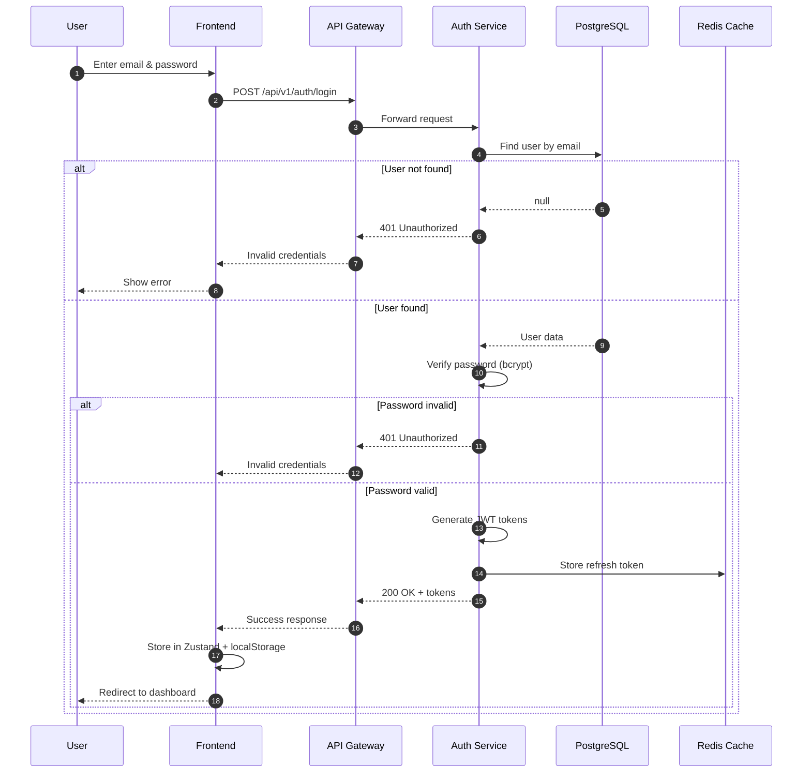
```mermaid
sequenceDiagram
    autonumber
    participant U as User
    participant FE as Frontend
    participant GW as API Gateway
    participant AS as Auth Service
    participant DB as PostgreSQL
    participant Redis as Redis Cache

    U->>FE: Enter email & password
    FE->>GW: POST /api/v1/auth/login
    GW->>AS: Forward request
    AS->>DB: Find user by email
    alt User not found
        DB-->>AS: null
        AS-->>GW: 401 Unauthorized
        GW-->>FE: Invalid credentials
        FE-->>U: Show error
    else User found
        DB-->>AS: User data
        AS->>AS: Verify password (bcrypt)
        alt Password invalid
            AS-->>GW: 401 Unauthorized
            GW-->>FE: Invalid credentials
        else Password valid
            AS->>AS: Generate JWT tokens
            AS->>Redis: Store refresh token
            AS-->>GW: 200 OK + tokens
            GW-->>FE: Success response
            FE->>FE: Store in Zustand + localStorage
            FE-->>U: Redirect to dashboard
        end
    end
```

### 1.3 Token Refresh

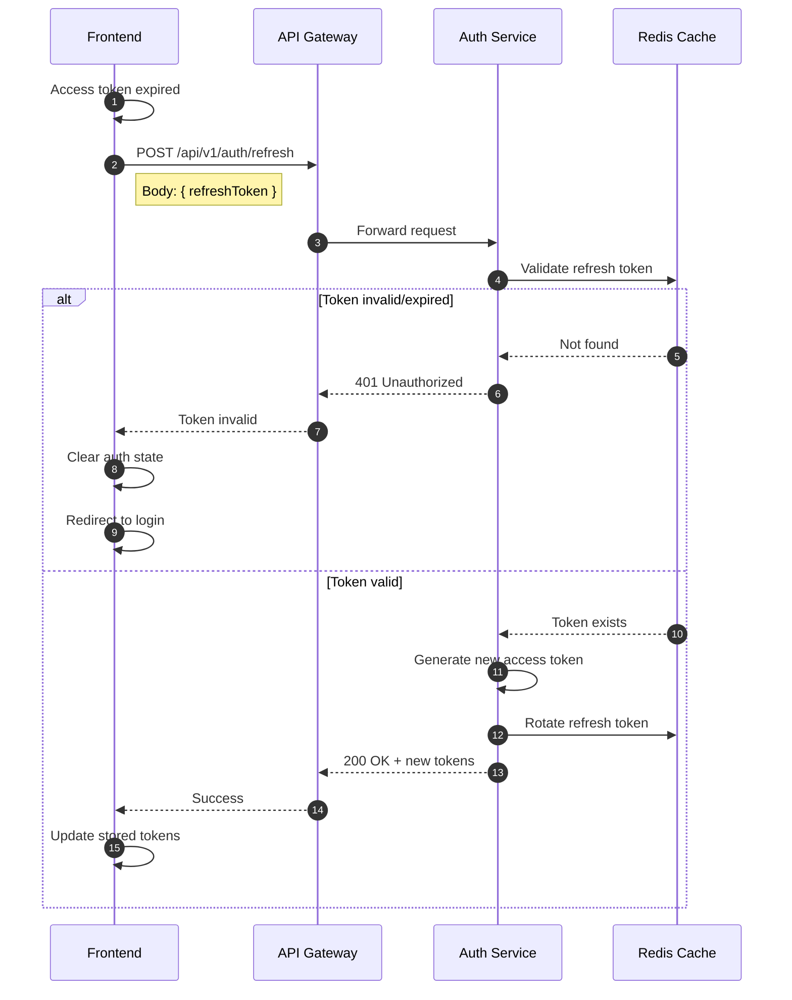
```mermaid
sequenceDiagram
    autonumber
    participant FE as Frontend
    participant GW as API Gateway
    participant AS as Auth Service
    participant Redis as Redis Cache

    FE->>FE: Access token expired
    FE->>GW: POST /api/v1/auth/refresh
    Note right of FE: Body: { refreshToken }
    GW->>AS: Forward request
    AS->>Redis: Validate refresh token
    alt Token invalid/expired
        Redis-->>AS: Not found
        AS-->>GW: 401 Unauthorized
        GW-->>FE: Token invalid
        FE->>FE: Clear auth state
        FE->>FE: Redirect to login
    else Token valid
        Redis-->>AS: Token exists
        AS->>AS: Generate new access token
        AS->>Redis: Rotate refresh token
        AS-->>GW: 200 OK + new tokens
        GW-->>FE: Success
        FE->>FE: Update stored tokens
    end
```

---

## 2. Product Browsing

### 2.1 Browse Products with Filters

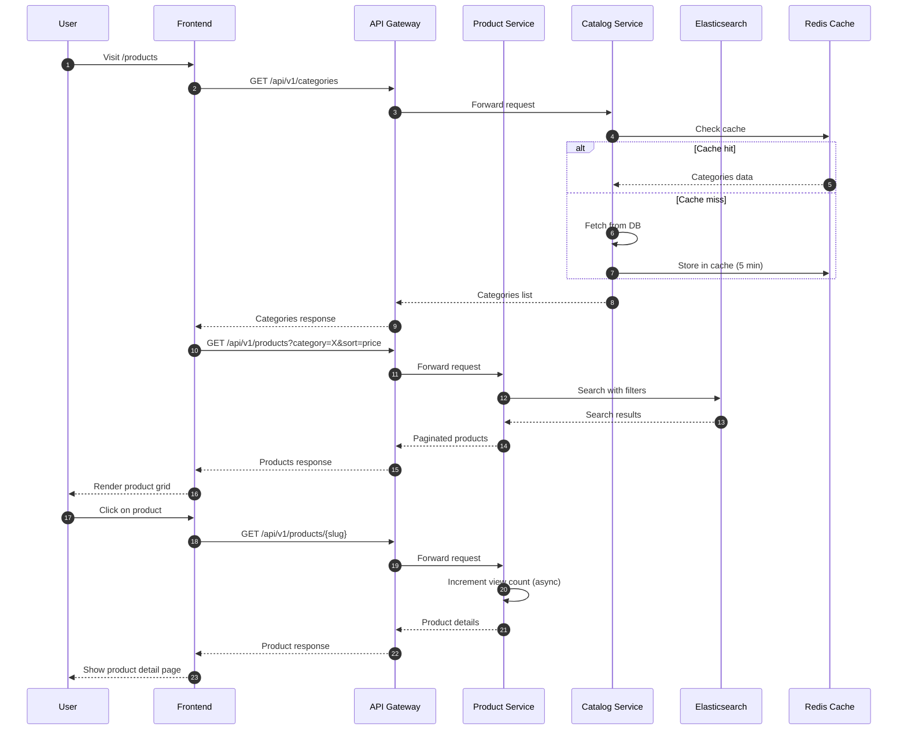
```mermaid
sequenceDiagram
    autonumber
    participant U as User
    participant FE as Frontend
    participant GW as API Gateway
    participant PS as Product Service
    participant CS as Catalog Service
    participant ES as Elasticsearch
    participant Redis as Redis Cache

    U->>FE: Visit /products
    FE->>GW: GET /api/v1/categories
    GW->>CS: Forward request
    CS->>Redis: Check cache
    alt Cache hit
        Redis-->>CS: Categories data
    else Cache miss
        CS->>CS: Fetch from DB
        CS->>Redis: Store in cache (5 min)
    end
    CS-->>GW: Categories list
    GW-->>FE: Categories response
    
    FE->>GW: GET /api/v1/products?category=X&sort=price
    GW->>PS: Forward request
    PS->>ES: Search with filters
    ES-->>PS: Search results
    PS-->>GW: Paginated products
    GW-->>FE: Products response
    FE-->>U: Render product grid

    U->>FE: Click on product
    FE->>GW: GET /api/v1/products/{slug}
    GW->>PS: Forward request
    PS->>PS: Increment view count (async)
    PS-->>GW: Product details
    GW-->>FE: Product response
    FE-->>U: Show product detail page
```

### 2.2 Product Search

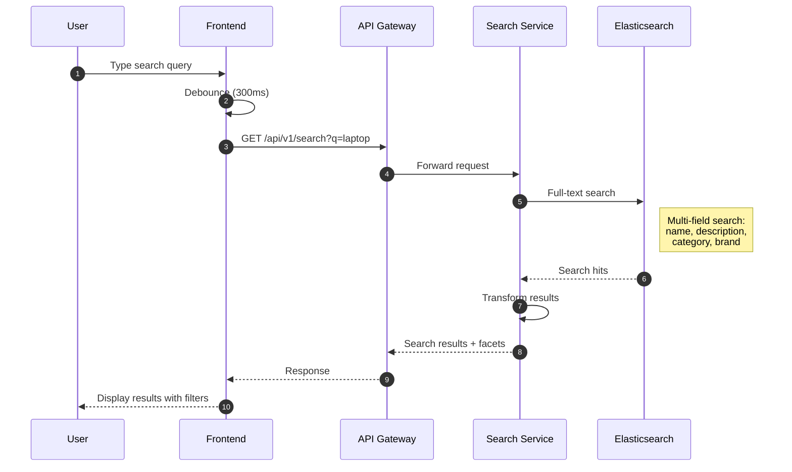
```mermaid
sequenceDiagram
    autonumber
    participant U as User
    participant FE as Frontend
    participant GW as API Gateway
    participant SS as Search Service
    participant ES as Elasticsearch

    U->>FE: Type search query
    FE->>FE: Debounce (300ms)
    FE->>GW: GET /api/v1/search?q=laptop
    GW->>SS: Forward request
    SS->>ES: Full-text search
    Note right of ES: Multi-field search:<br/>name, description,<br/>category, brand
    ES-->>SS: Search hits
    SS->>SS: Transform results
    SS-->>GW: Search results + facets
    GW-->>FE: Response
    FE-->>U: Display results with filters
```

---

## 3. Add to Cart

### 3.1 Guest User (Local Storage)

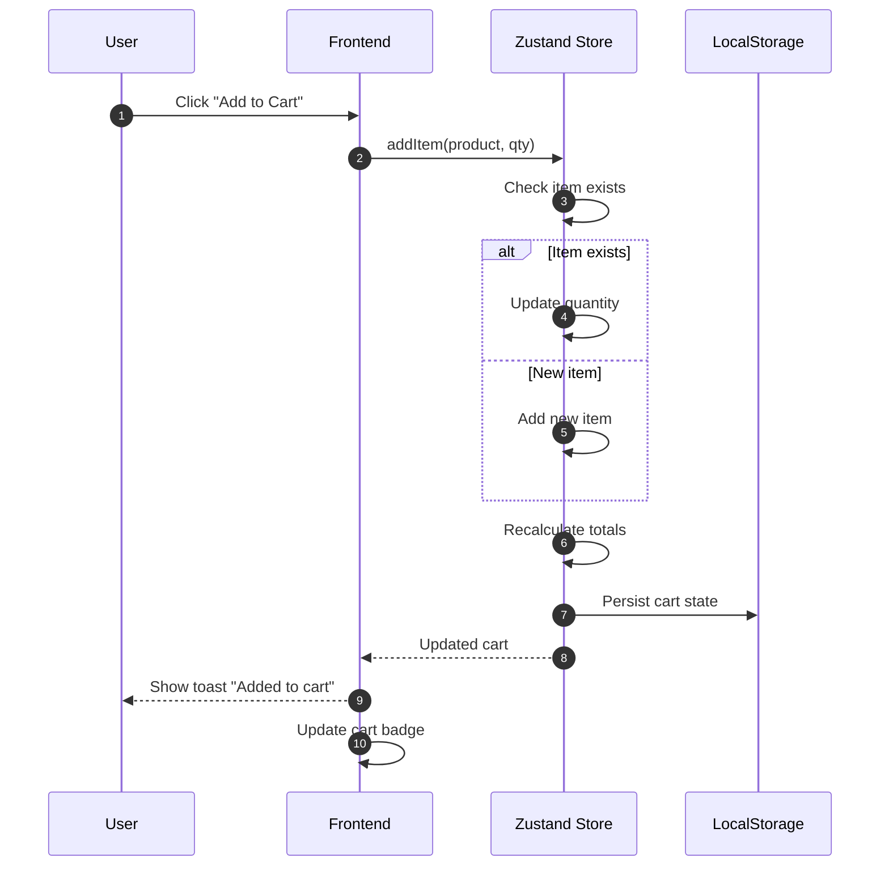
```mermaid
sequenceDiagram
    autonumber
    participant U as User
    participant FE as Frontend
    participant Store as Zustand Store
    participant LS as LocalStorage

    U->>FE: Click "Add to Cart"
    FE->>Store: addItem(product, qty)
    Store->>Store: Check item exists
    alt Item exists
        Store->>Store: Update quantity
    else New item
        Store->>Store: Add new item
    end
    Store->>Store: Recalculate totals
    Store->>LS: Persist cart state
    Store-->>FE: Updated cart
    FE-->>U: Show toast "Added to cart"
    FE->>FE: Update cart badge
```

### 3.2 Authenticated User (Server Cart)

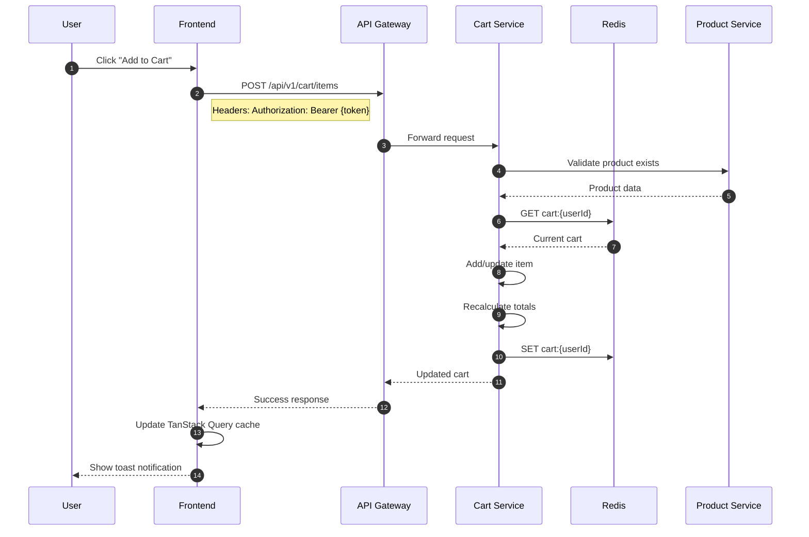
```mermaid
sequenceDiagram
    autonumber
    participant U as User
    participant FE as Frontend
    participant GW as API Gateway
    participant CS as Cart Service
    participant Redis as Redis
    participant PS as Product Service

    U->>FE: Click "Add to Cart"
    FE->>GW: POST /api/v1/cart/items
    Note right of FE: Headers: Authorization: Bearer {token}
    GW->>CS: Forward request
    CS->>PS: Validate product exists
    PS-->>CS: Product data
    CS->>Redis: GET cart:{userId}
    Redis-->>CS: Current cart
    CS->>CS: Add/update item
    CS->>CS: Recalculate totals
    CS->>Redis: SET cart:{userId}
    CS-->>GW: Updated cart
    GW-->>FE: Success response
    FE->>FE: Update TanStack Query cache
    FE-->>U: Show toast notification
```

### 3.3 Cart Merge on Login

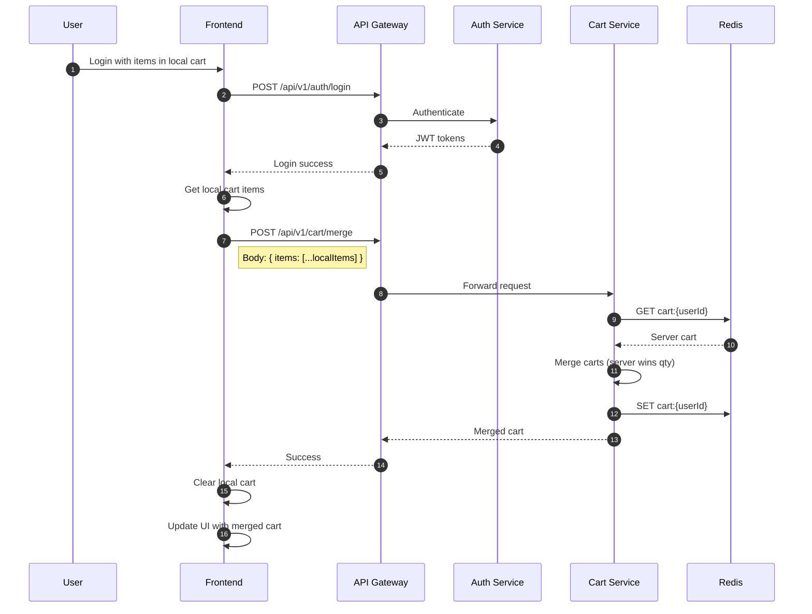
```mermaid
sequenceDiagram
    autonumber
    participant U as User
    participant FE as Frontend
    participant GW as API Gateway
    participant AS as Auth Service
    participant CS as Cart Service
    participant Redis as Redis

    U->>FE: Login with items in local cart
    FE->>GW: POST /api/v1/auth/login
    GW->>AS: Authenticate
    AS-->>GW: JWT tokens
    GW-->>FE: Login success
    
    FE->>FE: Get local cart items
    FE->>GW: POST /api/v1/cart/merge
    Note right of FE: Body: { items: [...localItems] }
    GW->>CS: Forward request
    CS->>Redis: GET cart:{userId}
    Redis-->>CS: Server cart
    CS->>CS: Merge carts (server wins qty)
    CS->>Redis: SET cart:{userId}
    CS-->>GW: Merged cart
    GW-->>FE: Success
    FE->>FE: Clear local cart
    FE->>FE: Update UI with merged cart
```

---

## 4. Checkout Flow

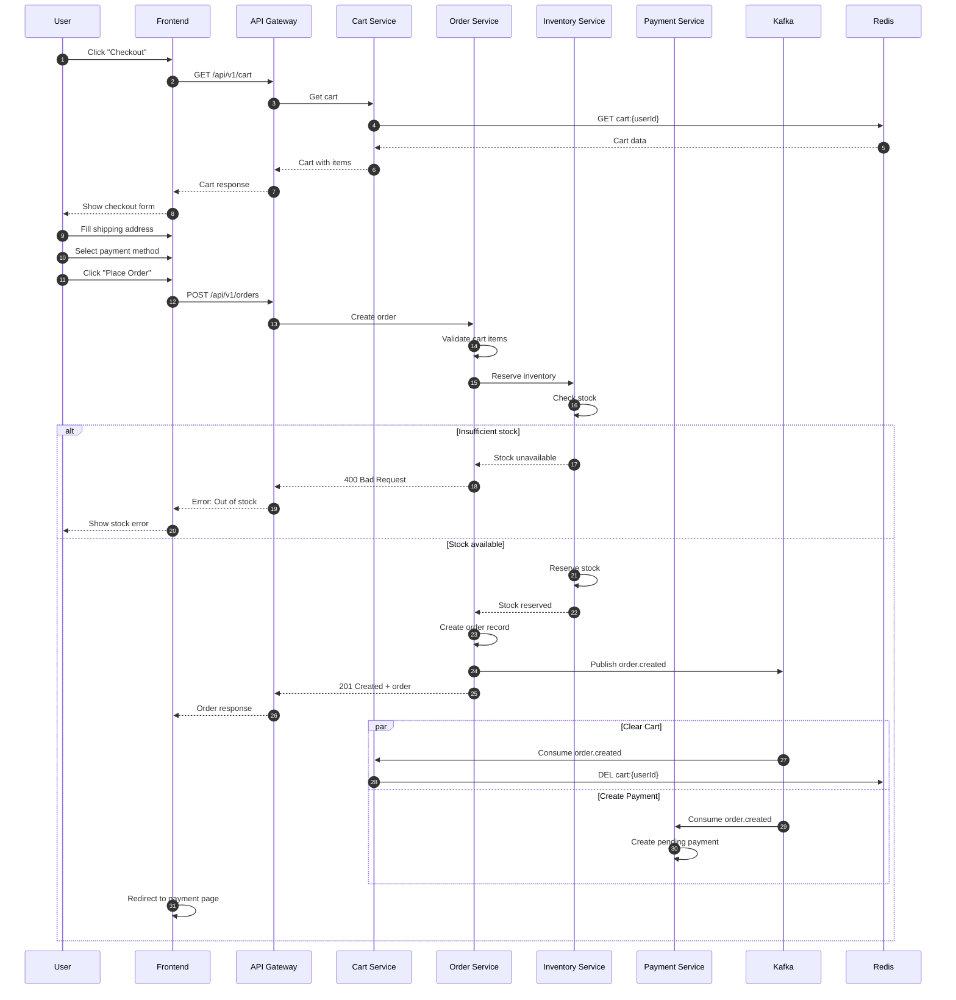
```mermaid
sequenceDiagram
    autonumber
    participant U as User
    participant FE as Frontend
    participant GW as API Gateway
    participant CS as Cart Service
    participant OS as Order Service
    participant IS as Inventory Service
    participant PS as Payment Service
    participant K as Kafka
    participant Redis as Redis

    U->>FE: Click "Checkout"
    FE->>GW: GET /api/v1/cart
    GW->>CS: Get cart
    CS->>Redis: GET cart:{userId}
    Redis-->>CS: Cart data
    CS-->>GW: Cart with items
    GW-->>FE: Cart response
    
    FE-->>U: Show checkout form

    U->>FE: Fill shipping address
    U->>FE: Select payment method
    U->>FE: Click "Place Order"

    FE->>GW: POST /api/v1/orders
    GW->>OS: Create order
    OS->>OS: Validate cart items
    OS->>IS: Reserve inventory
    IS->>IS: Check stock
    alt Insufficient stock
        IS-->>OS: Stock unavailable
        OS-->>GW: 400 Bad Request
        GW-->>FE: Error: Out of stock
        FE-->>U: Show stock error
    else Stock available
        IS->>IS: Reserve stock
        IS-->>OS: Stock reserved
        OS->>OS: Create order record
        OS->>K: Publish order.created
        OS-->>GW: 201 Created + order
        GW-->>FE: Order response
        
        par Clear Cart
            K->>CS: Consume order.created
            CS->>Redis: DEL cart:{userId}
        and Create Payment
            K->>PS: Consume order.created
            PS->>PS: Create pending payment
        end
        
        FE->>FE: Redirect to payment page
    end
```

---

## 5. Payment Processing

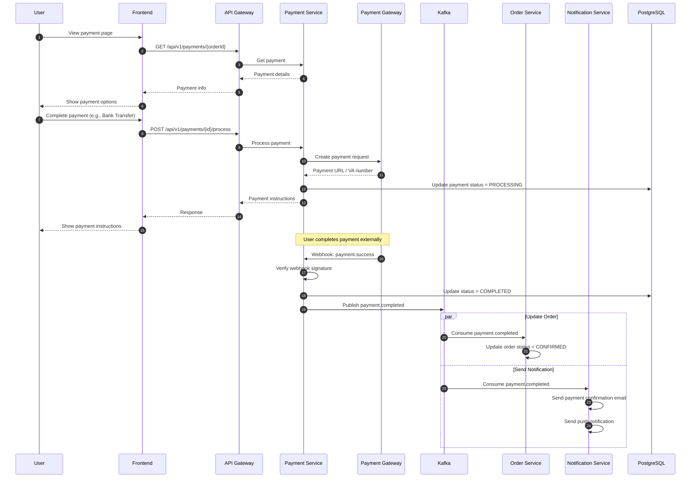
```mermaid
sequenceDiagram
    autonumber
    participant U as User
    participant FE as Frontend
    participant GW as API Gateway
    participant PS as Payment Service
    participant PGW as Payment Gateway
    participant K as Kafka
    participant OS as Order Service
    participant NS as Notification Service
    participant DB as PostgreSQL

    U->>FE: View payment page
    FE->>GW: GET /api/v1/payments/{orderId}
    GW->>PS: Get payment
    PS-->>GW: Payment details
    GW-->>FE: Payment info
    FE-->>U: Show payment options

    U->>FE: Complete payment (e.g., Bank Transfer)
    FE->>GW: POST /api/v1/payments/{id}/process
    GW->>PS: Process payment
    PS->>PGW: Create payment request
    PGW-->>PS: Payment URL / VA number
    PS->>DB: Update payment status = PROCESSING
    PS-->>GW: Payment instructions
    GW-->>FE: Response
    FE-->>U: Show payment instructions

    Note over PGW,PS: User completes payment externally

    PGW->>PS: Webhook: payment.success
    PS->>PS: Verify webhook signature
    PS->>DB: Update status = COMPLETED
    PS->>K: Publish payment.completed
    
    par Update Order
        K->>OS: Consume payment.completed
        OS->>OS: Update order status = CONFIRMED
    and Send Notification
        K->>NS: Consume payment.completed
        NS->>NS: Send payment confirmation email
        NS->>NS: Send push notification
    end
```

---

## 6. Order Fulfillment

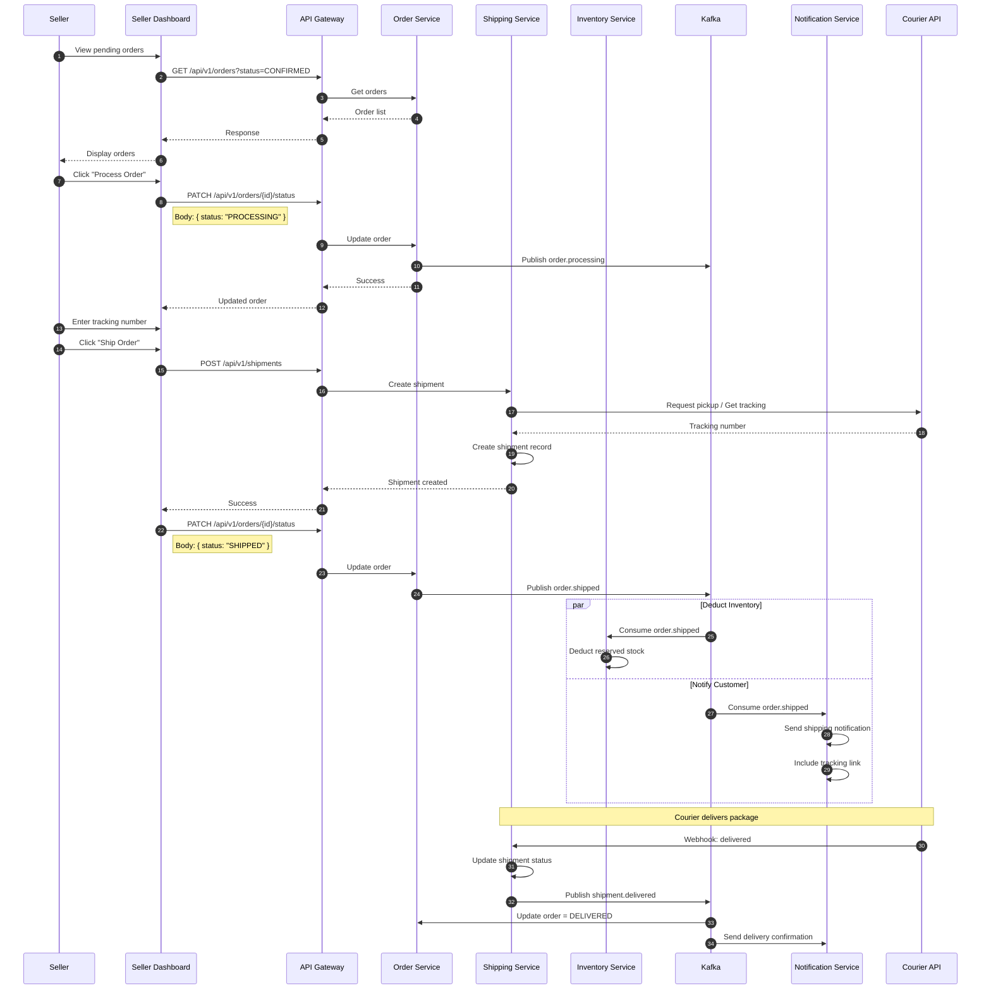
```mermaid
sequenceDiagram
    autonumber
    participant S as Seller
    participant FE as Seller Dashboard
    participant GW as API Gateway
    participant OS as Order Service
    participant SS as Shipping Service
    participant IS as Inventory Service
    participant K as Kafka
    participant NS as Notification Service
    participant C as Courier API

    S->>FE: View pending orders
    FE->>GW: GET /api/v1/orders?status=CONFIRMED
    GW->>OS: Get orders
    OS-->>GW: Order list
    GW-->>FE: Response
    FE-->>S: Display orders

    S->>FE: Click "Process Order"
    FE->>GW: PATCH /api/v1/orders/{id}/status
    Note right of FE: Body: { status: "PROCESSING" }
    GW->>OS: Update order
    OS->>K: Publish order.processing
    OS-->>GW: Success
    GW-->>FE: Updated order

    S->>FE: Enter tracking number
    S->>FE: Click "Ship Order"
    FE->>GW: POST /api/v1/shipments
    GW->>SS: Create shipment
    SS->>C: Request pickup / Get tracking
    C-->>SS: Tracking number
    SS->>SS: Create shipment record
    SS-->>GW: Shipment created
    GW-->>FE: Success

    FE->>GW: PATCH /api/v1/orders/{id}/status
    Note right of FE: Body: { status: "SHIPPED" }
    GW->>OS: Update order
    OS->>K: Publish order.shipped
    
    par Deduct Inventory
        K->>IS: Consume order.shipped
        IS->>IS: Deduct reserved stock
    and Notify Customer
        K->>NS: Consume order.shipped
        NS->>NS: Send shipping notification
        NS->>NS: Include tracking link
    end

    Note over C,SS: Courier delivers package

    C->>SS: Webhook: delivered
    SS->>SS: Update shipment status
    SS->>K: Publish shipment.delivered
    K->>OS: Update order = DELIVERED
    K->>NS: Send delivery confirmation
```

---

## 7. Seller Registration

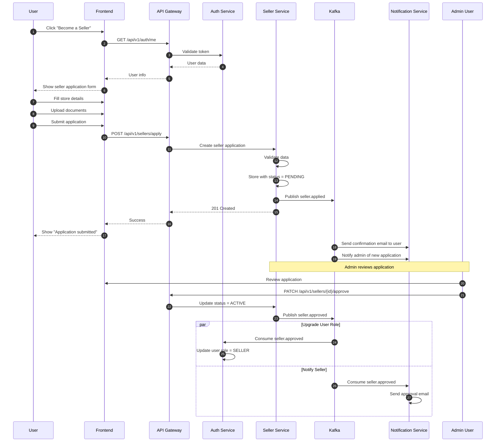
```mermaid
sequenceDiagram
    autonumber
    participant U as User
    participant FE as Frontend
    participant GW as API Gateway
    participant AS as Auth Service
    participant SS as Seller Service
    participant K as Kafka
    participant NS as Notification Service
    participant Admin as Admin User

    U->>FE: Click "Become a Seller"
    FE->>GW: GET /api/v1/auth/me
    GW->>AS: Validate token
    AS-->>GW: User data
    GW-->>FE: User info
    
    FE-->>U: Show seller application form

    U->>FE: Fill store details
    U->>FE: Upload documents
    U->>FE: Submit application
    
    FE->>GW: POST /api/v1/sellers/apply
    GW->>SS: Create seller application
    SS->>SS: Validate data
    SS->>SS: Store with status = PENDING
    SS->>K: Publish seller.applied
    SS-->>GW: 201 Created
    GW-->>FE: Success
    FE-->>U: Show "Application submitted"

    K->>NS: Send confirmation email to user
    K->>NS: Notify admin of new application

    Note over Admin,SS: Admin reviews application

    Admin->>FE: Review application
    Admin->>GW: PATCH /api/v1/sellers/{id}/approve
    GW->>SS: Update status = ACTIVE
    SS->>K: Publish seller.approved
    
    par Upgrade User Role
        K->>AS: Consume seller.approved
        AS->>AS: Update user role = SELLER
    and Notify Seller
        K->>NS: Consume seller.approved
        NS->>NS: Send approval email
    end
```

---

## 8. Product Review

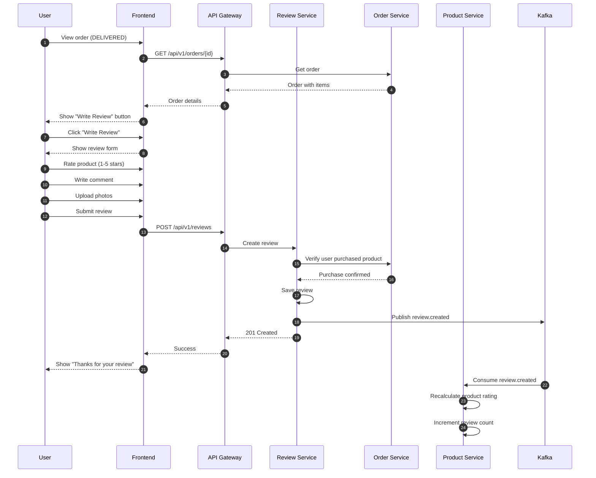
```mermaid
sequenceDiagram
    autonumber
    participant U as User
    participant FE as Frontend
    participant GW as API Gateway
    participant RS as Review Service
    participant OS as Order Service
    participant PS as Product Service
    participant K as Kafka

    U->>FE: View order (DELIVERED)
    FE->>GW: GET /api/v1/orders/{id}
    GW->>OS: Get order
    OS-->>GW: Order with items
    GW-->>FE: Order details
    FE-->>U: Show "Write Review" button

    U->>FE: Click "Write Review"
    FE-->>U: Show review form

    U->>FE: Rate product (1-5 stars)
    U->>FE: Write comment
    U->>FE: Upload photos
    U->>FE: Submit review

    FE->>GW: POST /api/v1/reviews
    GW->>RS: Create review
    RS->>OS: Verify user purchased product
    OS-->>RS: Purchase confirmed
    RS->>RS: Save review
    RS->>K: Publish review.created
    RS-->>GW: 201 Created
    GW-->>FE: Success
    FE-->>U: Show "Thanks for your review"

    K->>PS: Consume review.created
    PS->>PS: Recalculate product rating
    PS->>PS: Increment review count
```

---

## Event Flow Summary

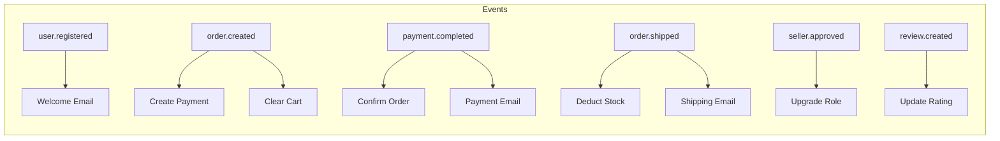
```mermaid
flowchart LR
    subgraph Events
        A[user.registered] --> NS1[Welcome Email]
        B[order.created] --> PS1[Create Payment]
        B --> CS1[Clear Cart]
        C[payment.completed] --> OS1[Confirm Order]
        C --> NS2[Payment Email]
        D[order.shipped] --> IS1[Deduct Stock]
        D --> NS3[Shipping Email]
        E[seller.approved] --> AS1[Upgrade Role]
        F[review.created] --> PS2[Update Rating]
    end
```

---

*Last Updated: January 2026*
